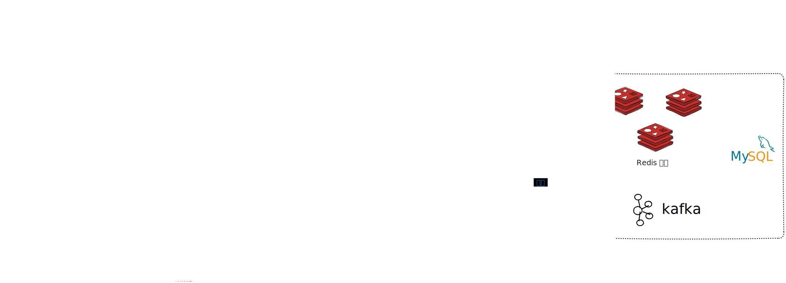

## 项目描述
本项目旨在促进校园内的信息流通，实现学生之间的高效沟通。通过提供一个生产和阅读内容的平台，学生可以便捷地发布与获取最新的校园信息。此平台不仅有助于信息的快速传播，还能提高学生之间的互动效率，营造一个更加紧密和高效的校园社区。

## 项目技术栈


## 项目结构
``` shell
.
├── TJU-campus-basic
│   └── TJU-campus-starter
├── TJU-campus-common
├── TJU-campus-feign-api
├── TJU-campus-gateway
│   ├── TJU-campus-app-gateway
│   └── TJU-campus-wemedia-gateway
├── TJU-campus-model
├── TJU-campus-service
│   ├── TJU-campus-article
│   ├── TJU-campus-behavior
│   ├── TJU-campus-schedule
│   ├── TJU-campus-user
│   └── TJU-campus-wemedia
├── TJU-campus-test
│   ├── es-init
│   ├── freemarker-demo
│   ├── kafka-demo
│   └── minio-demo
├── TJU-campus-utils
├── app-web
└── wemedia-web

```

## 模块详细介绍

### 1. TJU-campus-basic
- **TJU-campus-starter**：包含基本的配置和服务实现。主要负责项目的基础配置及一些基础服务的实现，为整个项目提供底层支持。

### 2. TJU-campus-common
- **constants**：定义项目中的常量。
- **exception**：处理项目中的异常。
- **jackson**：配置Jackson相关的序列化和反序列化。
- **redis**：Redis的配置类。
- **swagger**：Swagger的配置类。

### 3. TJU-campus-feign-api
- **article**：文章服务接口及其回退机制。
- **schedule**：计划服务接口。
- **wemedia**：媒体服务接口。

### 4. TJU-campus-gateway
- **TJU-campus-app-gateway**
    - **filter**：网关过滤器。
    - **util**：网关工具类。
- **TJU-campus-wemedia-gateway**
    - **filter**：网关过滤器。
    - **util**：网关工具类。

### 5. TJU-campus-model
- **entity**：定义项目中使用的实体类。
- **dto**：数据传输对象，用于各服务间的数据交换。
- **pojos**：简单的Java对象，用于封装数据。
- **vos**：值对象，用于表示数据层的视图。

### 6. TJU-campus-service
- **TJU-campus-article**：文章端
- **TJU-campus-behavior**：用户行为
- **TJU-campus-schedule**：定时任务
- **TJU-campus-user**：用户
- **TJU-campus-wemedia**：自媒体端

### 7. TJU-campus-test
- **es-init**：Elasticsearch初始化模块。
- **freemarker-demo**：Freemarker模板引擎示例模块。
- **kafka-demo**：Kafka消息队列示例模块。
- **minio-demo**：MinIO对象存储示例模块。

### 8. TJU-campus-utils
- **common**：通用工具类。
- **thread**：线程相关工具类。
