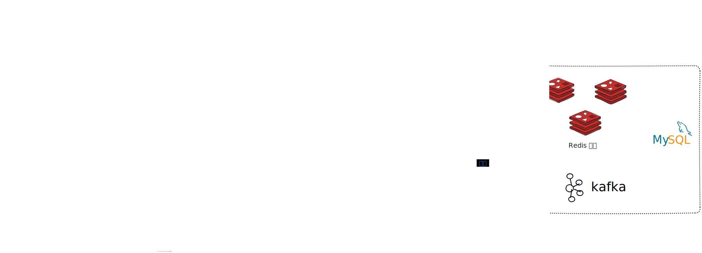

## 项目描述
本项目旨在促进校园内的信息流通，实现学生之间的高效沟通。通过提供一个生产和阅读内容的平台，学生可以便捷地发布与获取最新的校园信息。此平台不仅有助于信息的快速传播，还能提高学生之间的互动效率，营造一个更加紧密和高效的校园社区。

## 项目技术栈



## 模块详细介绍

### 1. TJU-campus-basic
- **TJU-campus-starter**：包含基本的配置和服务实现。主要负责项目的基础配置及一些基础服务的实现，为整个项目提供底层支持。

### 2. TJU-campus-common
- **constants**：定义项目中的常量。
- **exception**：处理项目中的异常。
- **jackson**：配置Jackson相关的序列化和反序列化。
- **redis**：Redis的配置类。
- **swagger**：Swagger的配置类。

### 3. TJU-campus-feign-api
- **article**：文章服务接口及其回退机制。
- **schedule**：计划服务接口。
- **wemedia**：媒体服务接口。

### 4. TJU-campus-gateway
- **TJU-campus-app-gateway**
    - **filter**：网关过滤器。
    - **util**：网关工具类。
- **TJU-campus-wemedia-gateway**
    - **filter**：网关过滤器。
    - **util**：网关工具类。

### 5. TJU-campus-model
- **entity**：定义项目中使用的实体类。
- **dto**：数据传输对象，用于各服务间的数据交换。
- **pojos**：简单的Java对象，用于封装数据。
- **vos**：值对象，用于表示数据层的视图。

### 6. TJU-campus-service
- **TJU-campus-article**
    - **controller**：处理文章相关的HTTP请求。
    - **service**：文章业务逻辑实现。
    - **repository**：文章数据访问层。
- **TJU-campus-behavior**
    - **controller**：处理行为相关的HTTP请求。
    - **service**：行为业务逻辑实现。
    - **interceptor**：拦截器，处理请求过滤。
- **TJU-campus-schedule**
    - **controller**：处理计划相关的HTTP请求。
    - **service**：计划业务逻辑实现。
    - **repository**：计划数据访问层。
- **TJU-campus-user**
    - **controller**：处理用户相关的HTTP请求。
    - **service**：用户业务逻辑实现。
    - **repository**：用户数据访问层。
- **TJU-campus-wemedia**
    - **controller**：处理自媒体相关的HTTP请求。
    - **service**：自媒体业务逻辑实现。
    - **repository**：自媒体数据访问层。

### 7. TJU-campus-test
- **es-init**：Elasticsearch初始化模块。
- **freemarker-demo**：Freemarker模板引擎示例模块。
- **kafka-demo**：Kafka消息队列示例模块。
- **minio-demo**：MinIO对象存储示例模块。

### 8. TJU-campus-utils
- **common**：通用工具类。
- **thread**：线程相关工具类。

### 9. app-web
包含静态资源，如图片、按钮、登录页面等。

### 10. wemedia-web
包含自媒体相关的静态资源，如CSS、字体、图片、JS等。


## 项目结构
``` shell
.
├── TJU-campus-basic
│ └── TJU-campus-starter
│     └── src
│         ├── main
│         │ ├── java
│         │ │ └── com/shawen/file
│         │ │     └── config
│         │ │     └── service
│         │ │         └── impl
│         │ └── resources
│         │     └── META-INF
│         └── test
│             └── java
├── TJU-campus-common
│ └── src
│     ├── main
│     │ ├── java
│     │ │ └── com
│     │ │     └── shawen
│     │ │         └── common
│     │ │             ├── constants
│     │ │             ├── exception
│     │ │             ├── jackson
│     │ │             ├── redis
│     │ │             └── swagger
│     │ └── resources
│     │     └── META-INF
│     └── test
│         └── java
├── TJU-campus-feign-api
│ └── src
│     ├── main
│     │ ├── java
│     │ │ └── com
│     │ │     └── shawen
│     │ │         └── apis
│     │ │             ├── article
│     │ │             │ └── fallback
│     │ │             ├── schedule
│     │ │             └── wemedia
│     │ └── resources
│     └── test
│         └── java
├── TJU-campus-gateway
│ ├── TJU-campus-app-gateway
│ │ └── src
│ │     ├── main
│ │     │ ├── java
│ │     │ │ └── com
│ │     │ │     └── shawen
│ │     │ │         └── app
│ │     │ │             └── gateway
│ │     │ │                 ├── filter
│ │     │ │                 └── util
│ │     │ └── resources
│ │     └── test
│ │         └── java
│ └── TJU-campus-wemedia-gateway
│     └── src
│         ├── main
│         │ ├── java
│         │ │ └── com
│         │ │     └── shawen
│         │ │         └── wemedia
│         │ │             └── gateway
│         │ │                 ├── filter
│         │ │                 └── util
│         │ └── resources
│         └── test
│             └── java
├── TJU-campus-model
│ └── src
│     ├── main
│     │ └── java
│     │     └── com
│     │         └── shawen
│     │             └── model
│     │                 ├── article
│     │                 │ ├── dtos
│     │                 │ ├── pojos
│     │                 │ └── vos
│     │                 ├── behavior
│     │                 │ └── dtos
│     │                 ├── common
│     │                 │ ├── annotation
│     │                 │ ├── dtos
│     │                 │ └── enums
│     │                 ├── mess
│     │                 ├── schedule
│     │                 │ ├── dtos
│     │                 │ └── pojos
│     │                 ├── search
│     │                 │ ├── dtos
│     │                 │ └── vos
│     │                 ├── user
│     │                 │ ├── dtos
│     │                 │ └── pojos
│     │                 └── wemedia
│     │                     ├── dtos
│     │                     └── pojos
│     └── test
│         └── java
├── TJU-campus-service
│ ├── TJU-campus-article
│ │ ├── logs
│ │ └── src
│ │     ├── main
│ │     │ ├── java
│ │     │ │ └── com
│ │     │ │     └── shawen
│ │     │ │         └── article
│ │     │ │             ├── config
│ │     │ │             ├── controller
│ │     │ │             │ └── v1
│ │     │ │             ├── feign
│ │     │ │             ├── job
│ │     │ │             ├── listener
│ │     │ │             ├── mapper
│ │     │ │             ├── service
│ │     │ │             │ └── impl
│ │     │ │             └── stream
│ │     │ └── resources
│ │     │     ├── mapper
│ │     │     └── templates
│ │     └── test
│ │         └── java
│ │             └── com
│ │                 └── shawen
│ │                     └── article
│ │                         ├── service
│ │                         │ └── impl
│ │                         └── test
│ ├── TJU-campus-behavior
│ │ └── src
│ │     └── main
│ │         ├── java
│ │         │ └── com
│ │         │     └── shawen
│ │         │         └── behavior
│ │         │             ├── config
│ │         │             ├── controller
│ │         │             │ └── v1
│ │         │             ├── interceptor
│ │         │             └── service
│ │         │                 └── impl
│ │         └── resources
│ ├── TJU-campus-schedule
│ │ └── src
│ │     ├── main
│ │     ├── java
│ │     │ └── com
│ │     │     └── shawen
│ │     │         └── schedule
│ │     │             ├── feign
│ │     │             ├── mapper
│ │     │             └── service
│ │     │                 └── impl
│ │     └── resources
│ │         └── mapper
│ ├── TJU-campus-user
│ │ └── src
│ │     ├── main
│ │     │ ├── java
│ │     │ │ └── com/shawen/user
│ │     │ │     └── config
│ │     │ │     ├── controller
│ │     │ │     │ └── v1
│ │     │ │     ├── mapper
│ │     │ │     └── service
│ │     │ │         └── impl
│ │     │ └── resources
│ │     └── test
│ │         └── java
│ └── TJU-campus-wemedia
│     └── src
│         ├── main
│         │ ├── java
│         │ │ └── com
│         │ │     └── shawen
│         │ │         └── wemedia
│         │ │             ├── config
│         │ │             ├── controller
│         │ │             │ └── v1
│         │ │             ├── feign
│         │ │             ├── interceptor
│         │ │             ├── mapper
│         │ │             └── service
│         │ │                 └── impl
│         │ └── resources
│         │     └── mapper
│         └── test
│             └── java
│                 └── com
│                     └── shawen
│                         └── wemedia
│                             └── service
├── TJU-campus-test
│ ├── es-init
│ │ └── src
│ │     ├── main
│ │     │ ├── java
│ │     │ │ └── com
│ │     │ │     └── shawen
│ │     │ │         └── es
│ │     │ │             ├── config
│ │     │ │             ├── mapper
│ │     │ │             └── pojo
│ │     │ └── resources
│ │     │     └── mapper
│ │     └── test
│ │         └── java
│ │             └── com
│ │                 └── shawen
│ │                     └── es
│ ├── freemarker-demo
│ │ └── src
│ │     ├── main
│ │     │ ├── java
│ │     │ │ └── com
│ │     │ │     └── shawen
│ │     │ │         └── freemarker
│ │     │ │             ├── controller
│ │     │ │             └── entity
│ │     │ └── resources
│ │     │     └── templates
│ │     └── test
│ │         └── java
│ │             └── com
│ │                 └── shawen
│ │                     └── freemarker
│ │                         └── test
│ ├── kafka-demo
│ │ └── src
│ │     ├── main
│ │     │ ├── java
│ │     │ │ └── com
│ │     │ │     └── shawen
│ │     │ │         └── kafka
│ │     │ │             ├── controller
│ │     │ │             ├── listener
│ │     │ │             ├── pojo
│ │     │ │             └── sample
│ │     │ └── resources
│ │     └── test
│ │         └── java
│ └── minio-demo
│     └── src
│         ├── main
│         │ ├── java
│         │ │ └── com
│         │ │     └── shawen
│         │ │         └── minio
│         │ └── resources
│         └── test
│             └── java
│                 └── com
│                     └── shawen
│                         └── minio
│                             └── test
├── TJU-campus-utils
│ └── src
│     ├── main
│     │ └── java
│     │     └── com
│     │         └── shawen
│     │             └── utils
│     │                 ├── common
│     │                 └── thread
│     └── test
│         └── java
├── app-web
│ └── static
│     └── images
│         ├── buttons
│         ├── login
│         ├── menus
│         └── menus_active
├── logs
└── wemedia-web
    └── static
        ├── css
        ├── fonts
        ├── img
        ├── js
        └── tinymce

```